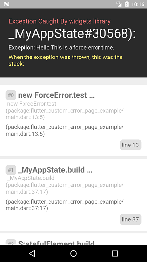
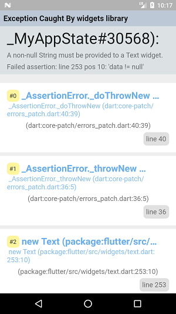
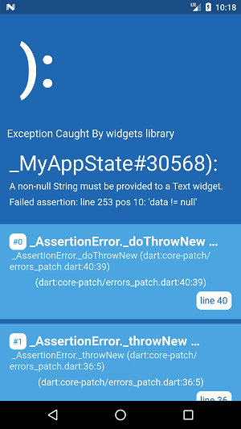

# flutter custom error message

Custom error page.





## Theme
```
ErrorMessageBuilder.build(theme: ErrorTheme.Laravel);
ErrorMessageBuilder.build(theme: ErrorTheme.VisualStudio);
ErrorMessageBuilder.build(theme: ErrorTheme.BlueScreen);
```


## Usage
You need to add two parts: before build MaterialApp/CupertinoApp and inside builder of MaterialApp.
```
  @override
  Widget build(BuildContext context) {

    ErrorWidget.builder = ErrorMessageBuilder.build(theme: ErrorTheme.Laravel);

    return MaterialApp(
      builder: (BuildContext context, Widget widget) {
        ErrorWidget.builder = ErrorMessageBuilder.build(theme: ErrorTheme.Laravel);
        return widget;
      },
      home: Scaffold(
        appBar: AppBar(
          title: Text(null), // Force exception.
        ),
        body: HomePage(),
      ),
    );
  }
```